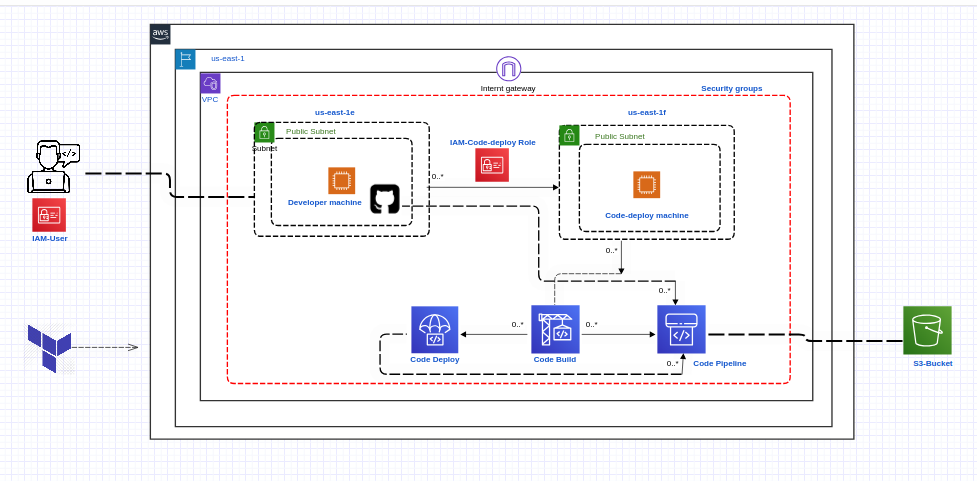

# Aws-CI-CD-project
A developer compiles the code and subsequently pushes it to their GitHub account. The code pipeline monitors this activity, builds the code, and deploys it to the web server and S3 bucket.

## *Architecture of ci/cd project*

